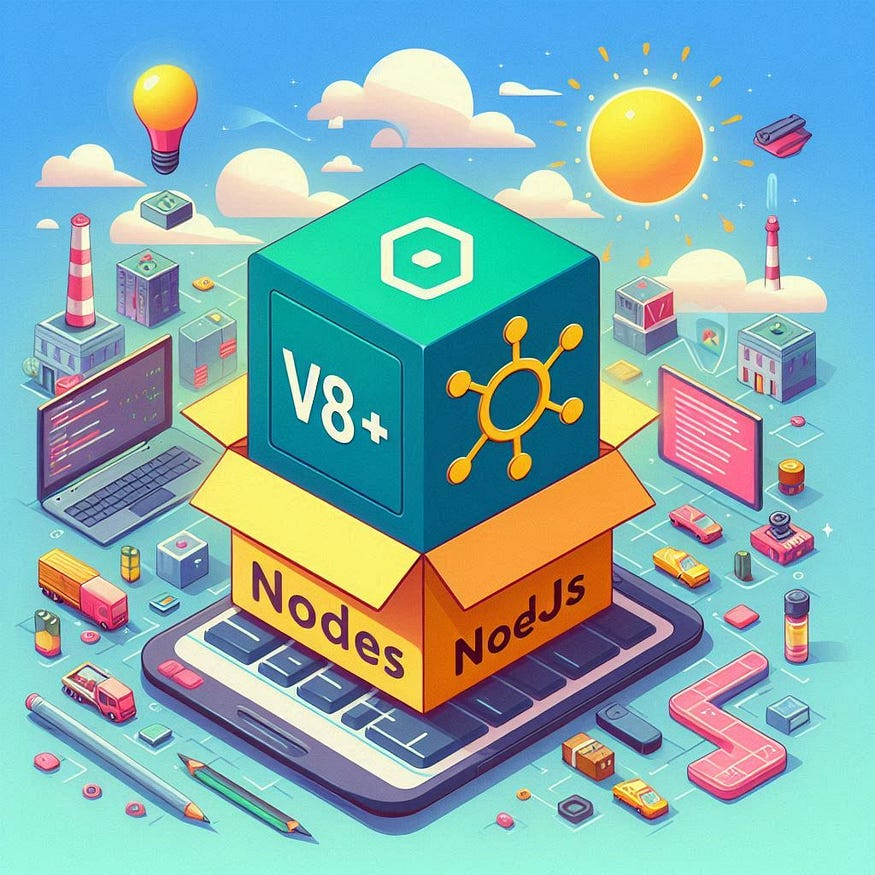
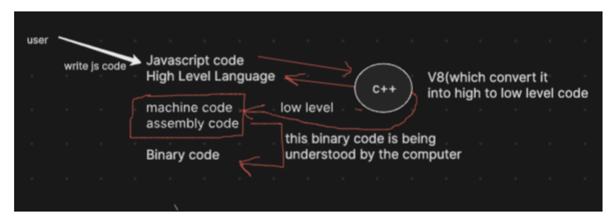

# 🚀 EPISODE-02: Javascript On Servers

### 💡 What is Server ?

💻 A server is a remote computer that provides resources, services, and programs to other devices, known as clients, over a network. It processes requests and delivers data to users via a network.

- 📡 Servers work remotely, enabling powerful computing.
- 🌐 JavaScript was originally designed to run only on browsers for client-side tasks.
- ⚡ Node.js allowed JavaScript to run on servers, making it a full-stack language for both client and server-side programming.

Behind the scenes, when a computer needs to communicate with a server, it sends a request to the server using its IP address. Initially, JavaScript could only be executed within web browsers, limiting its use to client-side tasks. However, with the introduction of Node.js, JavaScript can now also be executed on servers, allowing developers to use the same language for both client-side and server-side programming.

### 💡 What is Ecmascript ?

⚙️ ECMAScript is the standard for scripting languages, including JavaScript, JScript, and ActionScript. It defines the rules for JavaScript's behavior.

- 🌍 Ensures consistent behavior across different environments (like browsers and servers).
- 🛠️ JavaScript engines like V8, SpiderMonkey, and Chakra follow ECMAScript standards.

### 💡 What is V8 ?

- 🚀 V8 is Google’s open-source, high-performance JavaScript and WebAssembly engine, written in C++.
- 🔧 It is used in Chrome and Node.js to run JavaScript code efficiently.
- 🖥️ V8 converts JavaScript code into machine code, which the computer can execute directly.

### 💡 V8 is c++ Code ?

NODEJS is a c++ application with v8 embedded into it

- ECMAScript is a standard for scripting languages, including JavaScript, JScript, and ActionScript. It is best known as the standard that defines
  JavaScript.
- ECMAScript standards are followed by JavaScript engines like V8, SpiderMonkey, Chakra, and others to ensure consistent behavior across different environments.
- so , v8 engines has to follow this ECMA standards. and node.js has v8 engines, but node.js also has some superpowers, such as api calls on servers,
  which make it more powerful than v8 engines alone, which cannot do database connections, api calls, etc. because of ECMA standards. and this is
  known as the JS runtime.
- V8 is C++ code.
  Ever wonder how your JavaScript code comes to life? 🤔 We write JS, and then the V8 engine translates it into machine and assembly code—also known as low level code—so the machine can understand it. It's amazing how our high-level scripts transform into the instructions that power our apps!

Low-level code refers to programming languages or code that is closer to machine language and hardware. It provides little abstraction from the computer's architecture and allows for fine-grained control over system resources. Here are some key points about low-level code:

1. Machine Language: The most basic form of low-level code, consisting of binary (0s and 1s) instructions that the computer's CPU can directly execute.
2. Assembly Language: A step above machine language, assembly language uses symbolic representations (mnemonics) for operations and memory addresses, making it somewhat easier for humans to read and write. Each assembly instruction corresponds to a specific machine language instruction

### 💡 Why use Node Js on servers ?

🧑‍💻 Node.js enhances JavaScript by combining the V8 engine with additional features (like APIs and modules). This allows it to perform tasks like database connections and handling API requests, which are beyond the scope of the V8 engine alone.

Node.js gives JavaScript "superpowers" 🚀, making it more powerful than just a browser-based language.
