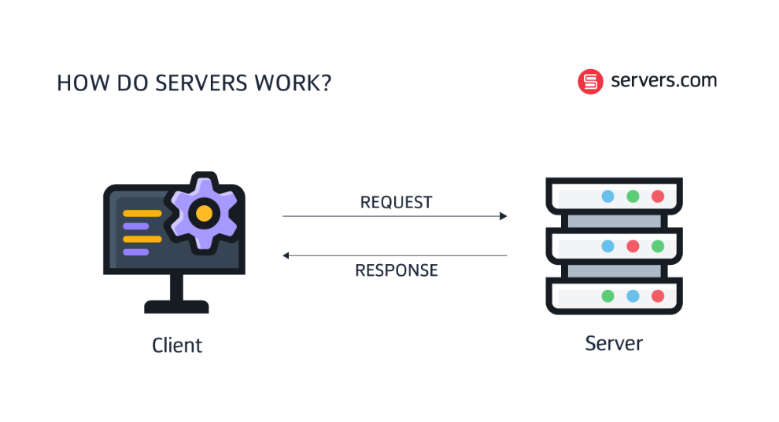

# 🚀 EPISODE-02: Javascript On Servers

### 💡 What is Server ?

A server is essentially a remote computer. You can think of it as a computer
whose CPU works remotely.Servers can be accessed over a network to provide resources and services to other computer programs.A server is a computer or system that provides data, services, resources, or programs to other computers, known as clients, over a network.

Behind the scenes, when a computer needs to communicate with a server, it sends a request to the server using its IP address. Initially, JavaScript could only be executed within web browsers, limiting its use to client-side tasks. However, with the introduction of Node.js, JavaScript can now also be executed on servers, allowing developers to use the same language for both client-side and server-side programming.

### 💡 What is Ecmascript ?

- ECMAScript is a standard for scripting languages, including JavaScript,JScript, and ActionScript. It is best known as the standard that defines JavaScript.
- ECMAScript standards are followed by JavaScript engines like V8, SpiderMonkey, Chakra, and others to ensure consistent behavior across different environments.

