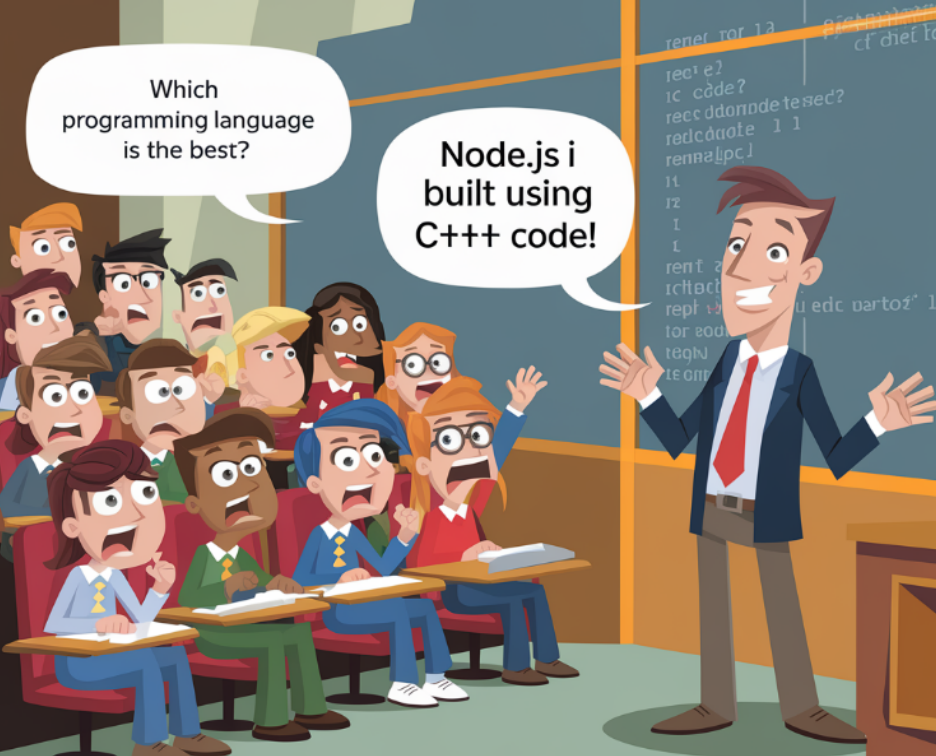

# 🚀 EPISODE-02: Javascript On Servers

### 💡 What is Server ?

A server is essentially a remote computer. You can think of it as a computer
whose CPU works remotely.Servers can be accessed over a network to provide resources and services to other computer programs.A server is a computer or system that provides data, services, resources, or programs to other computers, known as clients, over a network.

Behind the scenes, when a computer needs to communicate with a server, it sends a request to the server using its IP address. Initially, JavaScript could only be executed within web browsers, limiting its use to client-side tasks. However, with the introduction of Node.js, JavaScript can now also be executed on servers, allowing developers to use the same language for both client-side and server-side programming.

### 💡 What is Ecmascript ?

- ECMAScript is a standard for scripting languages, including JavaScript,JScript, and ActionScript. It is best known as the standard that defines JavaScript.
- ECMAScript standards are followed by JavaScript engines like V8, SpiderMonkey, Chakra, and others to ensure consistent behavior across different environments.

### 💡 What is V8 ?

V8 is Google’s open source high-performance JavaScript and WebAssembly engine, written in C++. It is used in Chrome and in Node.js, among others. It implements ECMAScript and WebAssembly, and runs on Windows, macOS, and Linux systems that use x64, IA-32, or ARM processors. V8 can be embedded into any C++ application.

- The V8 JavaScript engine is written in C++.
- V8 can be embedded into any C++ program, which is a crucial feature.
- The process works as follows: JavaScript code is executed by V8 (written in C++), which then compiles it down to machine code that the computer can
  execute.

### 💡 V8 is c++ Code ?

NODEJS is a c++ application with v8 embedded into it

- ECMAScript is a standard for scripting languages, including JavaScript, JScript, and ActionScript. It is best known as the standard that defines
  JavaScript.
- ECMAScript standards are followed by JavaScript engines like V8, SpiderMonkey, Chakra, and others to ensure consistent behavior across different environments.
- so , v8 engines has to follow this ECMA standards. and node.js has v8 engines, but node.js also has some superpowers, such as api calls on servers,
  which make it more powerful than v8 engines alone, which cannot do database connections, api calls, etc. because of ECMA standards. and this is
  known as the JS runtime.
- V8 is C++ code.
  Ever wonder how your JavaScript code comes to life? 🤔 We write JS, and then the V8 engine translates it into machine and assembly code—also known as low level code—so the machine can understand it. It's amazing how our high-level scripts transform into the instructions that power our apps!

Low-level code refers to programming languages or code that is closer to machine language and hardware. It provides little abstraction from the computer's architecture and allows for fine-grained control over system resources. Here are some key points about low-level code:

1. Machine Language: The most basic form of low-level code, consisting of binary (0s and 1s) instructions that the computer's CPU can directly execute.
2. Assembly Language: A step above machine language, assembly language uses symbolic representations (mnemonics) for operations and memory addresses, making it somewhat easier for humans to read and write. Each assembly instruction corresponds to a specific machine language instruction

### 💡 Why use Node Js on servers ?

I think you have now a idea why use node js on servers instead of directly using Js.
Node js have the V8 engine + Node Api and Modules (superPower), it gives superpowers to the Node js
