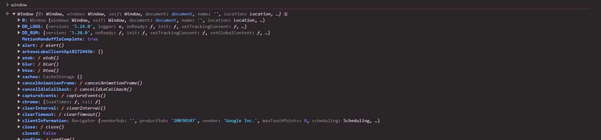
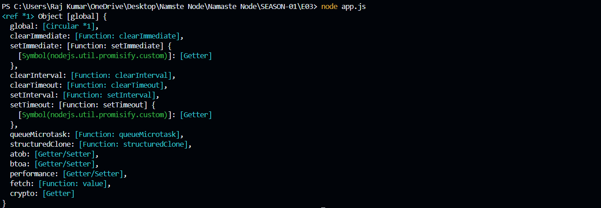

# 📥 EPISODE-02: Let's Write Code


First, download and install Node.js on your system from the official website. Node.js comes with npm (Node Package Manager), which is essential for managing and installing packages in your JavaScript projects.

### ✅ 2. Verifying the Installation

Once Node.js is installed, open your terminal and verify the installation by running the following commands:

```bash
    node -v
    npm -v
```

- node -v checks the version of Node.js installed.
- npm -v checks the version of npm installed.
  If both commands return version numbers, congratulations! 🎉 Node.js and npm have been installed successfully.

### 💻 3. Writing Code with Node REPL

The Node REPL (Read, Evaluate, Print, Loop) is an interactive environment where you can test and execute JavaScript code directly from your terminal. Here's how to get started:

- 🚀 Start Node REPL
  Open your terminal and type:

```bash
    node
```

Once inside the REPL, you can write and evaluate JavaScript code on the fly. For example:

```bash
    > let name = "Hello, Node!";
    > console.log(name);
```

The REPL will immediately execute and display the result of your code. It's a great way to experiment quickly!

### 🛠 What is Node.js?

Node.js is a JavaScript runtime environment that allows you to run JavaScript outside of a browser. It uses Google’s powerful V8 engine (also used by Chrome) to execute your code, making it incredibly fast.

### 📝 4. Writing JavaScript in VS Code

While the REPL is great for small experiments, you’ll want to use an editor like Visual Studio Code (VS Code) for larger projects. Follow these steps to get started:

- 🗂️ Step 1: Create a Project Folder

1. On your system, create a new folder to store your project files.
2. Name the folder something like NodeJS_Project.

- 🖥️ Step 2: Open the Folder in VS Code

1. Right-click the folder and select Open with Code (if you have this option in your context menu).
2. If not, open VS Code and navigate to File > Open Folder, then select your project folder.

- 📝 Step 3: Create a New File

1. In VS Code, right-click in the Explorer pane and select New File.
2. Name the file app.js.

- 🛠️ Step 4: Write Some Basic JavaScript Code
  Open app.js and write the following code:

```bash
    let name = "Node JS 03";
    let a = 5;
    let b = 10;
    let c = a + b;

    console.log(name);  // Outputs: Node JS 03
    console.log(c);     // Outputs: 15
```

- 💡 Step 5: Run Your Code

1. Open the terminal in VS Code by pressing Ctrl + \ (backtick) or selecting Terminal > New Terminal from the menu.
2. In the terminal, run the following command:

```bash
    node app.js
```

Output in Terminal

```bash
    Node JS 03
    15
```

### 📝 Let’s talk about global objects in NodeJS.

- The window object is a global object provided by the browser, not by the V8 engine.



- Now, In Node.js, the global object is known as global , which is equivalent to the window object in the browser.



- A global object is not a part of the V8 engine; instead, it’s a feature provided by Node.js.
- This global object offers various functionalities, such as setTimeout() , setInterval() , and more.

#### Important Note:

console.log(this); // Outputs: {}
When you use console.log(this); at the global level in Node.js, it will log an empty object, indicating that this does not refer to the global object in this context.
#### Global this
is always a global object, regardless of where it is accessed. It was introduced in ECMAScript 2020 to provide a standardized way to refer to the global object in
any environment (browsers, Node.js, etc.).
- In browsers, global is equivalent to window .
- In Node.js, globalThis is equivalent to global .
It provides a consistent way to access the global object without worrying about the environment.
